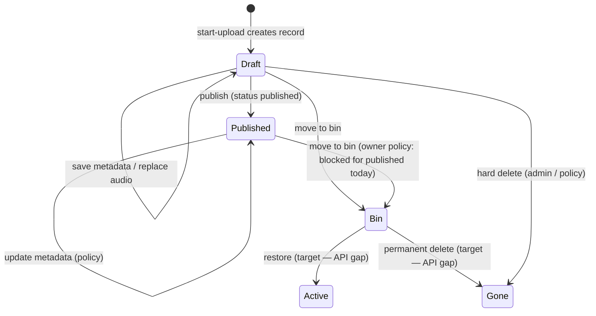

# feat-0006: Studio sermon CRUD — upload, drafts, library, bin, first publish

## Summary

**Ministers** and **creators** manage audio sermons in Troott Studio under **`/studio/{studioCode}/…`**: upload audio, save **drafts**, **publish**, **read** and filter the sermon library, **update** metadata, and **delete** via **move to bin** (soft delete) with a dedicated **Bin** page. The same upload wizard and APIs apply to both personas.

**First-time publish** (Get Started step 6): when a studio user publishes their **first** sermon while onboarding is incomplete, the product must complete onboarding ([feat-0005](../feat-0005/PRODUCT.md) UC-C72 / UC-C72a) and hide Get Started.

Complements [feat-0004](../feat-0004/PRODUCT.md) (studio URLs), [feat-0005](../feat-0005/PRODUCT.md) (onboarding + upload entry), and legacy flow docs [`04 - sermon-upload-draft.md`](../../04%20-%20sermon-upload-draft.md) / [`05 - sermon-view-trash.md`](../../05%20-%20%20sermon-view-trash.md) (use cases retained; routing updated here).

## Problem

Sermon lifecycle behavior is spread across upload modals, TanStack list queries, draft context, sermon APIs, and onboarding hooks. Without one feature spec:

- It is unclear which operations are **CRUD** vs **workflow** (upload steps vs publish).
- **Draft** means both “upload in progress” and “upload done, unpublished” but only some paths persist to the server.
- **Bin** is linked in the sidebar but the page is not implemented; restore/permanent-delete rules are undefined on web.
- **Creators** share upload UI but list/upload code still assumes **minister id** for queries and payloads.
- **First publish** must advance onboarding for minister **and** creator; that coupling is easy to miss when changing publish.

## Non-goals

- Listener consumption, mobile upload, or public teaser pages ([`../api/deep-links.md`](../../../api/deep-links.md) if present).
- Series and playlists tabs on My Sermons (UI placeholders only until separate specs).
- Admin sermon moderation console ([feat-0003](../feat-0003/PRODUCT.md) admin routes).
- Audio processing pipeline internals (workers, transcoding) — see [`specs/api/feature/feat-0006`](../../../api/feature/feat-0006/PRODUCT.md)
- Replacing legacy `/minister/:id/audio` URLs (product uses `/studio/{code}/sermons`).

## Figma

[Figma file `9lFM6TncipSv0pNVGBWZwA`](https://www.figma.com/design/9lFM6TncipSv0pNVGBWZwA/Troott) — pixel-accuracy and implementation checklist: [feat-0018](../feat-0018/PRODUCT.md).

| Frame | Node | Surface |
| ----- | ---- | ------- |
| My Sermons empty / library | [`10154:35090`](https://www.figma.com/design/9lFM6TncipSv0pNVGBWZwA/Troott?node-id=10154-35090) | List chrome, empty table, Create sermon |
| Library with drafts | [`10209:78627`](https://www.figma.com/design/9lFM6TncipSv0pNVGBWZwA/Troott?node-id=10209-78627) | Draft rows + filter |
| Upload listener settings | [`4506:21677`](https://www.figma.com/design/9lFM6TncipSv0pNVGBWZwA/Troott?node-id=4506-21677) | Wizard tab |
| Upload modal shell (height ref) | [`4530:20801`](https://www.figma.com/design/9lFM6TncipSv0pNVGBWZwA/Troott?node-id=4530-20801) | Details step — standard modal height |

## Actors

| Actor | Persona | Description |
|-------|---------|-------------|
| **Studio content owner** | Minister or creator | Owns sermons for their studio; full CRUD within policy. |
| **Returning studio user** | Minister or creator | Has at least one sermon; uses Create sermon + list filters. |
| **New studio user** | Minister or creator | Empty library; first upload may complete Get Started step 6. |
| **Platform admin** | Admin / super-admin | May hard-delete published sermons when API allows `allowPublishedDelete`. |

## Shared definitions

| Term | Meaning |
|------|---------|
| **Sermon** | Audio content record with metadata, `status` (e.g. draft / published), `state` (e.g. active / deleted). |
| **Draft** | Sermon **not published** — includes upload in progress and upload complete but unpublished. |
| **Published** | Sermon live per `status` and visibility; appears in default library list. |
| **Bin** | Soft-deleted sermons (`state` / `status` deleted); excluded from default library; shown on Bin page. |
| **Upload wizard** | Multi-step flow: file → details → thumbnail → publish/review ([`paths.ts`](../../../apps/web/src/routes/paths.ts) segments under `sermons/upload`). |
| **First-time publish** | First successful **published** sermon while studio onboarding incomplete; triggers onboarding completion. |

## Studio routing (product)

All surfaces below live under **`/studio/{studioCode}/…`** with **lowercase** `studioCode` ([feat-0004](../feat-0004/PRODUCT.md)).

| Surface | Route pattern | UI shape |
|---------|-------------|----------|
| **My Sermons (library)** | `/studio/{code}/sermons` | Full page — list/grid, filters, actions |
| **Upload wizard** | `/studio/{code}/sermons/upload`, `…/file`, `…/details`, `…/thumbnail`, `…/publish` | Full-page shell hosting upload **modal** |
| **Resume / edit** | `/studio/{code}/sermons/:sermonId`, `…/resume`, `…/edit` | Placeholder or modal resume (product: modal parity) |
| **Bin** | `/studio/{code}/bin` | Full page — trashed sermons |

Entry points: sidebar **Sermons**, **Create sermon** on library (`/studio/{code}/sermons`), Get Started hub **Upload first sermon** ([feat-0005](../feat-0005/PRODUCT.md)). All studio upload entry (including first-time) uses the **same** flow as **Create sermon** on My Sermons — not a separate dashboard drop zone or bare `/sermons/upload` without audio selection.

## Sermon lifecycle (state machine)

**Product rules (aligned with API today):**

- **Create:** `POST /sermon/start-upload` creates or advances a draft row with audio asset.
- **Read:** Library lists exclude **deleted** rows; Bin lists **only** deleted rows (target once Bin ships).
- **Update:** `PUT /sermon/update/:id` for metadata; `POST /sermon/publish/:id` for publish or explicit draft save via publish payload `status: draft`.
- **Delete (soft):** `PUT /sermon/move-to-bin/:id` — non-admin owners **cannot** move **published** sermons to bin (API policy).
- **Delete (hard):** `DELETE /sermon/delete/:id` — stricter policy; published requires admin flag.

## CRUD use case catalog

### R — Read (library & detail)

| ID | Actor | Goal | Trigger | Success |
|----|-------|------|---------|---------|
| **UC-R01** | Studio user | View sermon library | Opens `/studio/{code}/sermons` | Paginated list for owning minister/creator scope |
| **UC-R02** | Studio user | Search sermons | Types in search box | Debounced `q` filter on list API |
| **UC-R03** | Studio user | Filter by status | Chooses draft / published / all | List query `status` param |
| **UC-R04** | Studio user | Sort sermons | Changes sort | `sort` param applied |
| **UC-R05** | Studio user | Open sermon detail | Clicks row | Detail loaded (`GET /sermon/:id`) for resume/edit |
| **UC-R06** | Studio user | Empty library | No sermons yet | Empty state + primary Upload CTA |
| **UC-R07** | Studio user | View bin | Opens `/studio/{code}/bin` | Lists soft-deleted sermons only (target) |

### C — Create (upload)

| ID | Actor | Goal | Trigger | Success |
|----|-------|------|---------|---------|
| **UC-C01** | Studio user | Start new sermon | **Create sermon** on `/studio/{code}/sermons` | `UploadEntryStepModal` → audio selected → `/sermons/upload` + `UploadModal` |
| **UC-C02** | Studio user | Upload audio | Selects valid audio file | **One** `start-upload` returns sermon id; progress shown ([feat-0008](../feat-0008/PRODUCT.md)) |
| **UC-C03** | Studio user | Upload cover | Optional thumbnail step | `image-upload` stores cover |
| **UC-C04** | Studio user | Abort in-flight upload | Closes wizard during upload | Client aborts request; server row policy documented in TECH |
| **UC-C05** | Studio user | Replace audio before publish | Change file on draft | New `start-upload` (same or new id per API) |

### U — Update (metadata & publish)

| ID | Actor | Goal | Trigger | Success |
|----|-------|------|---------|---------|
| **UC-U01** | Studio user | Enter metadata | Details step | Title, description, topic, tags stored locally and/or via update API |
| **UC-U02** | Studio user | Set visibility / listener settings | Publish settings step | Public / schedule fields captured |
| **UC-U03** | Studio user | Save as draft | Review → Save draft | `publish` with `status: draft` or update; row visible on library |
| **UC-U04** | Studio user | Publish sermon | Review → Publish | `status: published`; library refreshes |
| **UC-U05** | Studio user | Resume draft | Opens draft from library | Wizard loads sermon id + metadata |
| **UC-U06** | Studio user | Edit published sermon | Edit action (when enabled) | Metadata update without republish rules per API |

### D — Delete (bin & permanent)

| ID | Actor | Goal | Trigger | Success |
|----|-------|------|---------|---------|
| **UC-D01** | Studio user | Move draft to bin | Delete / move to trash on draft | `move-to-bin`; removed from library |
| **UC-D02** | Studio user | Move published to bin | Trash on published | **Blocked** for non-admin (show clear error) |
| **UC-D03** | Studio user | Restore from bin | Restore on Bin page | Sermon returns to library (target — API TBD) |
| **UC-D04** | Studio user | Delete forever | Delete permanently on Bin | Hard delete (target — API TBD) |
| **UC-D05** | Admin | Hard-delete published | Admin tooling with flag | `DELETE` with `allowPublishedDelete` |

## Draft-specific (cross-cutting)

| ID | Description |
|----|-------------|
| **UC-DR01** | Draft row appears on library once server has sermon id, even if wizard closed mid-upload. |
| **UC-DR02** | Draft without audio shows empty audio column; after upload, filename/duration appear automatically. |
| **UC-DR03** | Client draft context (`DraftProvider`) mirrors server drafts (`status: draft`) for minister-scoped lists. |
| **UC-DR04** | Save draft requires sermon id from completed `start-upload` (no orphan metadata-only save). |

## Upload wizard (step contract)

| Step | Route segment | User action | Server effect |
|------|---------------|-------------|---------------|
| 1 File | `sermons/upload` or `…/file` | Pick audio | `POST /sermon/start-upload` |
| 2 Details | `…/details` | Title, description, category, tags | Local + optional `PUT update` |
| 3 Thumbnail | `…/thumbnail` | Cover image | `POST /sermon/image-upload` |
| 4 Publish | `…/publish` | Review, Save draft, Publish | `POST /sermon/publish/:id` |

Closing the wizard returns user to **My Sermons** or Get Started per entry path; list queries invalidate on save/publish.

## First-time sermon upload (onboarding step 6)

### UI parity with Create sermon (My Sermons)

First-time upload (**UC-F01–F05**) must use the **same UI sequence** as **UC-C01** on `/studio/{code}/sermons`:

1. Land on **My Sermons** (empty state or list with toolbar).
2. Open **`UploadEntryStepModal`** (audio pick / drag-drop) — same chrome as **Create sermon**.
3. After valid audio, navigate to `/studio/{code}/sermons/upload` and open **`UploadModal`** (progress → details → listener settings → review).

**Not allowed for first-time entry:** studio home inline `FileUploadZone` only, Get Started links that open `/sermons/upload` with no file, or wizard tabs before step 1 audio selection.

| Entry | Target behavior |
|-------|-----------------|
| Get Started hub **Upload sermon** | Navigate to `/studio/{code}/sermons/upload` → upload wizard modal (legacy onboarding path) |
| Tour **Continue** after step 5 | Same — `/studio/{code}/sermons/upload` |
| My Sermons empty **Create sermon** | Entry modal → wizard (reference implementation) |
| My Sermons toolbar **Create sermon** | Same |
| Direct `/sermons/upload` without audio | Redirect to sermons + `openCreateSermon` |
| Resume / edit draft | Skip entry modal; open wizard with `resumeSermonId` |

| ID | Actor | Preconditions | Behavior |
|----|-------|---------------|----------|
| **UC-F01** | Minister | `minister.onboarding` not completed; tour step done | Publish first sermon → `onboardingFirstSermonComplete` + `minister.onboarding.status === completed'` |
| **UC-F02** | Creator | `creator.onboarding` / `user.onboard` not completed; tour done | Same wizard; publish → `creator.onboardingFirstSermonComplete` + synced `user.onboard` |
| **UC-F03** | Both | **Upload first sermon** from Get Started hub or post-tour | Direct `/studio/{code}/sermons/upload/…` wizard; publish completes step 6 |
| **UC-F04** | Both | Publish when onboarding already complete | Normal publish only; no duplicate milestone calls (idempotent APIs) |
| **UC-F05** | Both | Save draft only during first-time flow | Onboarding **not** completed until **published** (draft save does not complete step 6) |

See [feat-0005](../feat-0005/PRODUCT.md) UC-C70–C72a for hub and checkpoint alignment.

## Acceptance criteria (product)

1. Minister and creator can complete upload → draft → publish via **Create sermon** entry modal → `/studio/{code}/sermons/upload/…` (including first-time / Get Started).
2. Library at `/studio/{code}/sermons` shows drafts and published sermons with search, sort, and status filters.
3. Move to bin works for **draft** sermons; published move shows policy error for non-admin.
4. First **published** sermon completes Get Started for the active persona.
5. Bin page lists trashed sermons and supports restore/delete when APIs exist (see TECH gaps).
6. After publish or save draft, the new/updated row appears without manual full page reload (query invalidation).

## Related

- [feat-0005 PRODUCT](../feat-0005/PRODUCT.md) — Get Started + first upload
- [feat-0004 PRODUCT](../feat-0004/PRODUCT.md) — Sidebar links to sermons / bin / upload
- [`04 - sermon-upload-draft.md`](../../04%20-%20sermon-upload-draft.md) — legacy UC-U* detail
- [`05 - sermon-view-trash.md`](../../05%20-%20%20sermon-view-trash.md) — legacy UC-V* detail
